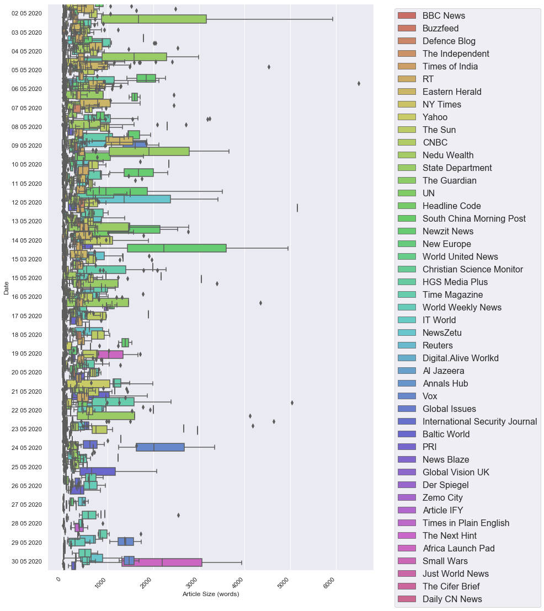
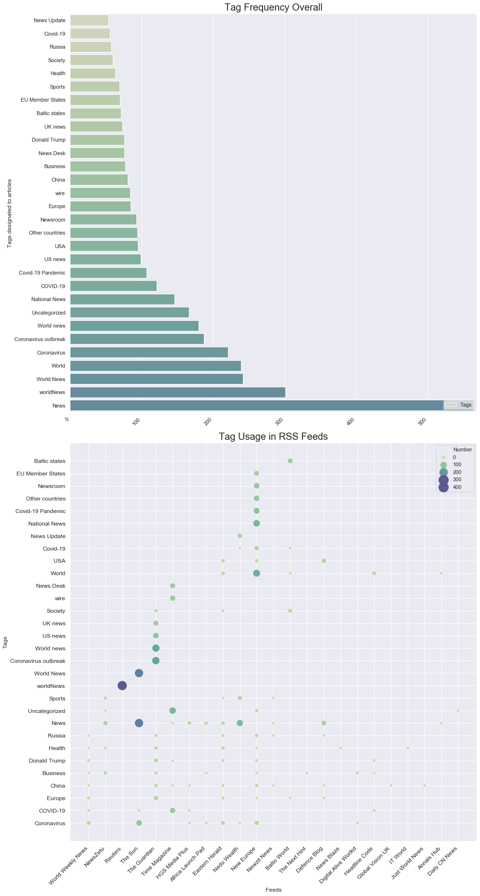
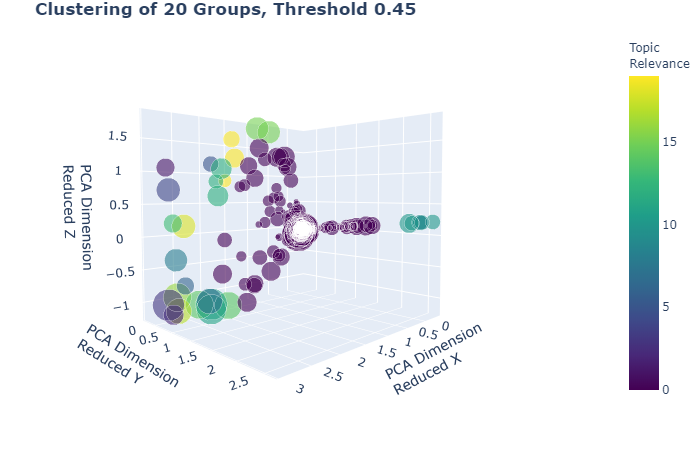
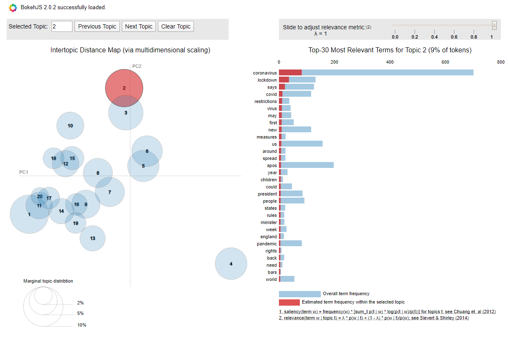
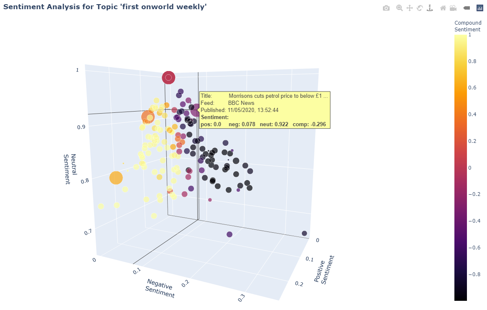
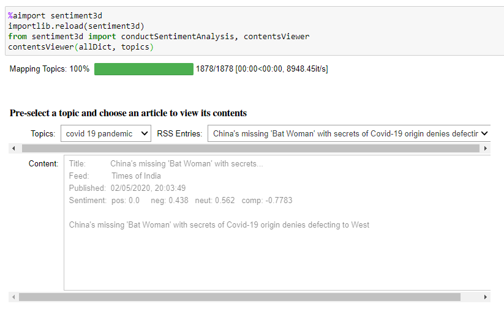

# Big-Data
Python project to scrape RSS news feeds, derive topic maps and analye sentiment. 
Multiple visualizations are displayed in a Jupyter Notebook

## Getting Started

The easiest approach is to clone this repository (https://github.com/jb-diplom/Big-Data/edit/master/README.md) and test the Notebook [RSSNewsIdentification.ipynb](./RSSNewsIdentification.ipynb) on Jupyter.

### Prerequisites

To run all the implemented features you'll need:
* Python 3.7 or newer
* Jupyter (Version 6.0.3 was used for the project)
* Anaconda (for easy and consistent installation)
* Gensim (for Word Embedding tools and downloader, corpora, topic modelling)
* Natural Language Toolkit (NLTK) for text processing (Lemmatization)
* VaderSentiment (Sentiment analysis)
* Bokeh (Visualization widgets and coloring)
* Feedparser (Scraping RSS Feeds)
* pyLDAvis (Visualization of LDA analysis)
* ipyvolume (3d rotational scatterplots) 
* Beautiful Soup (parsing and cleaning HTML/XML)
* sklearn (spectral clustering and dimension reduction using the PCA method)

### Installation
Several Python packages are necessary to complete analysis/computations and for an adequate visualization in Jupyter notebook
* `conda install bokeh`
* `conda install feedparser `
* `conda install genism `
* `conda install -c conda-forge pyldavis ` see also https://github.com/bmabey/pyLDAvis
* `conda install -c conda-forge ipyvolume`
* `conda install -c conda-forge nodejs`
* `conda install -c conda-forge ipydatawidgets`
* `import nltk`
* `nltk.download(’vader_lexicon’)`
* `nltk.download()` --> choose Corpora/wordnet

## Usage

The central element to access the funtionality of the project work is by loading the [RSSNewsIdentification.ipynb](./RSSNewsIdentification.ipynb) Jupyter Notebook.
Virtually all of the useful configurative settings can be specified or modified in the run parameters, which are held in an editable Python dictionary in a cell near the beginning of the notebook. Plausibel parameters are documented as comments in the code (see below).

### The Run Parameters
```
runParams={'allFeeds':       getFeedDict(),   # A collection of 50 URLs for RSS Feeds, where the names can be chosen freely
                                              # example: {'Buzzfeed': 'https://www.buzzfeed.com/world.xml', 
                                              #           'Al Jazeera': 'http://www.aljazeera.com/xml/rss/all.xml'}
           'collectFeeds':   False,           # Set to True to do more data-scraping
           'inputDir':       './data',        # Directory containing pre-collected RSS-Feed data in pickle format
           'articleLimit':   10000,           # Optional specification limiting number of articles to process (for test
                                              # purposes only)
           'numAuthDispl':   30,              # specify limit of number of authors to display/plot
           'numTagsDispl':   30,              # specify limit of number of tags to display/plot
           'numTopics':      30,              # specify limit of number of topics to be found via TFIDF Vectorization
           'numLDATopics':   30,              # specify limit of number of topics to be found via Latent Dirichlet Allocation 
           'numTopicsDispl': 30,              # specify limit of number of topics to display/plot
           'removeTopics':   True,            # specify if articles now referenced by topics should be removed (saves 
                                              # computation time later)
           'ngramRange':     (3,3),           # define min and max ngrams as tuple for deriving topic maps 
           'weModel':        'glove-wiki-gigaword-50', # Word Embedding model for soft cosine similarity calculation
                                              # options are e.g. glove-wiki-gigaword-50,fasttext-wiki-news-subwords-300
                                              # CAUTION: although higher dimension models produce more nuanced results, load
                                              # times are VERY long. In particular the first time use requires a download of
                                              # massive amounts of data which can easily take as much as an hour
           'thresholdFuzzy': 60,              # define cut-off threshold for fuzzy (Levenshtein Distance comparison) in percent
           'thresholdCosine':0.60,            # define cut-off threshold for soft cosine similarity as fraction (0.0 to 1.0)
           'fuzzyDocLimit':  None,            # optional integer limit to number of articles used for fuzzy relevance of
                                              # topics (only for test purposes: default None) 
           'matrixDir':      './outdata',     # relative path for saving matrices to file
           'saveMatrix':     False}           # whether to save matrix to file or not
```
### A few Words on Performance
Due to the potentially large amounts and numbers of data involved, running the notebook in its entirety can take many hours. This may yeild very interesting results, but you may also be interested in a quick overview. Some key parameters and options have been designed to help you (and especially me) to run through tests fairly quickly. The following settings are critical for performance and running times:
* `weModel` Tests have shown - not surprisingly - far better quality of results with higher dimension word embeddings. However, start times and running times in calculating the soft cosine similarity matrix easily run into hours (or a dead end) with `fasttext-wiki-news-subwords-300`. For speed, definitely use the preconfigured `glove-wiki-gigaword-50`
* `removeTopics` If set to false, then the running time will be typically (depending also on number of topics required and thresholds) a factor 3 or 4 longer. Theoretically you may miss out on some possible clustering which the soft cosine method finds but TF-IDF doesn't by removing articles, but it's probably sufficient to specify a few topics more and save a lot or computational time, by using this flag.
* `collectFeeds` If you just want to play with the test data and don't need fresh articles, the scraping stage can be skipped by setting this to `False`
* `articleLimit` By setting this to 1000 or less you can get a quick overview of the analysis results. If you want to be sure to miss none of the article content, you have to set this to `None`, though. Probably time tp grab a capuccino, in that case :-)
* `thresholdFuzzy`and `thresholdCosine` in practice you get to see some optically interesting results with lower values here. However this costs time and tends to include clustering which will be more like noise than anything else.

### Test Data
Two crucial sets of data are supplied to help the user get up and running very quickly.
1. A set of 50 fully tested RSS-Feed URLs, which are loaded from the function `getFeedDict()`. The user can simply specify custom values in an equivalently structured dictionary,  .e.g.
> ``` {'Buzzfeed': 'https://www.buzzfeed.com/world.xml', 'Al Jazeera': 'http://www.aljazeera.com/xml/rss/all.xml'}```
2. A corpora of over 11000 articles which have been collected between 02.05.2020 and 31.05.2020 daily from the 50 RSS-feeds mentioned in 1.  
An article limit `articleLimit` can be specified for test purposes to take a randomized sample of documents from the test corpora. It should be mentioned that with 10000 documents the runtime for the complete notebook runs into several hours.

### Features

Initially the user can load data from a pre-configured set of 50 RSS-Feeds, or specify custom feeds for scraping. This takes typically aproximately 75s (can be skipped using runParam `collectFeeds`. Additionally there is a large corpus of test data in the directory [data directory](./data/) which may be loaded for test purposes.

The steps which can be walked through are:
1. Custom configuration of `runParam`
2. Data collection from the specified RSS-feeds. The collected data is saved in pickle format to the [data directory](./data/) 
3. All data from the test corpus in [data directory](./data/)  are loaded. The number of articles may be reduced according to runParam articleLimit`. The HTML content is parsed and stripped of tags, some data cleaning occurs to remove some articles which are known to not contain sinle stories, but rather collections of all the day's news.
4. A brief summary of the articles scraped/loaded is displayed in tabular form as a quick check (note that a more thorough biew of the content is available later in the content viewer
5. To get an impression of the range of publish dates and article sizes per feed a box-plot is created
6. A statistical overview of the most prolific authors is displayed
7. Statistical overviews of the most used tags - as specified by the publishers - are displayed (bar chart and scatterplot)
8. Stop words are removed from the content, TF-IDF vectorization with Lemmatization is used to convert the amassed content of the corpus into documents to a matrix of TF-IDF features deriving the specified number of topics. TF-IDF Transformer additionally scales down the impact of tokens that occur very frequently in the given corpus and that are hence empirically less informative than features occuring in a small fraction of the corpus. The user can specify not only the preferred number of features but also the n-gram range
9. The topics from 8. are compared using a Levenshtein Distance calculation to each article in the corpus. Topics within a relevant tolerance (a threshold level is specified per parameter) are held as a reference with each article including the value for relevance as a percentage. Articles may have - any often do have - references to several topics.
10. An overview of the most frequent topics and frequency of occurence for each feed publisher are displayed in a scatter plot, 
11. The overall topic frequency is visualized in a histogram
12. The soft cosine similarity matrix is derived for the corpus to ascertain similarities between every combinational pair of articles. This employs word embeddings for the calculation of the comparison vectors (see also https://www.machinelearningplus.com/nlp/cosine-similarity/)
13. Using the soft cosine similarity matrix, multiple 3d visualizations of the clusters are produced. The colourization is simply achieved through the application of spectral clustering, a representation of the coordinates of the "bubbles" is achieved through dimension reduction using the PCA method, to acieve a physical separation according to the cosine similarity, whilst the size of each bubble is calculated to be proportional to the highest topical relevance from the article's rom taken from the similarity matrix.
The user may specify the number of topics to display and the cut-off threshold for deciding if an article should be represented in the plot.
14. A specified number of topics are representen in the pyLDAvis visualization
15. A sentiment analysis of each article is conducted using Vader. A 3d scatterplot of the sentiment for topically grouped sets of articles. The coordinates are derived from the positiv, negativ and neutral sentiment values. The colour represents the compound sentiment. The size of the bubbles are exponentially proportional to the strength of topicality (cf topical relevance percentage in 9. above) for the preferred topic which can be conveniently chosen from a pull-down list of possible topics. A change of topic triggers a redraw of the 3d-visualization.
16. Finally the user can browse through the article content grouped by topic. The article content together with a subset of meta-data for the article is displayed in a viewer.

## Some Graphics from the Notebook
### Article Sizes

### Tag Usage

### Cosine Similarity (3d interactive plot)

### LDA Visualization (pyLDAvis interactive viewer)

### Sentiment Analysis (3d interactive plot)

### Content Viewer


## Versioning

All code is versioned in Github in [this repository](https://github.com/jb-diplom/Big-Data). 

## Authors

* **Janice Butler** - *Initial work* - [Big-Data Project](https://github.com/jb-diplom/Big-Data)

## License

This project is licensed under the MIT License - see the [LICENSE.md](LICENSE.md) file for details

## Acknowledgments

* Many thanks to Damian Trilling for the ideas on using cosine similarity and Levenshtein Distance
